<a name="top"></a>

<div align="center">



# KiCAD MCP Server

[🇺🇸 **English** (EN)](#) &nbsp;•&nbsp; [🇩🇪 **Deutsch** (DE)](README.de.md) &nbsp;•&nbsp; [🇨🇳 **中文** (ZH)](README.zh.md)

[](../LICENSE)
[](../docs/PLATFORM_GUIDE.md)
[](https://www.kicad.org/)
[](https://github.com/mixelpixx/KiCAD-MCP-Server/stargazers)
[](https://github.com/mixelpixx/KiCAD-MCP-Server/discussions)

</div>

<!-- prettier-ignore-start -->
<div align="center">

#### Our new forum is up: https://forum.orchis.ai — Need help? Have suggestions? Want to show off your work?

</div>
<!-- prettier-ignore-end -->

> ##  Meet Konnect — the next generation
>
> **[Konnect](https://github.com/mixelpixx/Konnect)** is this project rebuilt from
> scratch in Rust as a native KiCAD 10 plugin: a single binary with no runtime
> dependencies, built on KiCAD's official IPC API instead of SWIG, with 171 tools,
> bundled Claude skills and agents, design-review audits, and a manufacturing
> pipeline. It's where new development happens — licensed AGPL-3.0 (free for
> individuals and open source; commercial licenses available for businesses).
>
> This Python/TypeScript server remains fully open (MIT) and maintained.
>
> ## KiCAD MCP and Konnect works well with Nimrod
>
> [**Nimrod**](https://nimrod.orchis.ai) is our web-research MCP server:
> quality-scored Google search, clean webpage extraction, and deep multi-source
> research. Design the board with Konnect while Nimrod pulls live parts availability, datasheets,
> and errata — no more guessing from year-old training data
>
> - Works with claude.ai, Claude Desktop, Claude Code, VS Code, and any MCP client
> - 1 credit = 1 search · extraction always free · free 50-credit trial, no card
> - Official MCP Registry: [`ai.orchis/nimrod`](https://registry.modelcontextprotocol.io)


#

**KiCAD MCP Server** is a Model Context Protocol (MCP) server that enables AI assistants like Claude to interact with KiCAD for PCB design automation. Built on the MCP 2025-06-18 specification, this server provides comprehensive tool schemas and real-time project state access for intelligent PCB design workflows.

### Design PCBs with natural language

Describe what you want to build — and let AI handle the EDA work. Place components, create custom symbols and footprints, route connections, run checks, and export production files, all by talking to your AI assistant.

### What it can do today

- Project setup, schematic editing, component placement, routing, DRC/ERC, export
- **Custom symbol and footprint generation** — for modules not in the standard KiCAD library
- **Personal library management** — create once, reuse across projects
- **JLCPCB integration** — parts catalog with pricing and stock data
- **Freerouting integration** — automatic PCB routing via Java/Docker
- **Visual feedback** — snapshots and session logs for traceability
- **Cross-platform** — Windows, Linux, macOS

### Quick Start

1. Install [KiCAD 9.0+](https://www.kicad.org/download/)
2. Install [Node.js 18+](https://nodejs.org/) and [Python 3.11+](https://www.python.org/)
3. Clone and build:

```bash
git clone https://github.com/mixelpixx/KiCAD-MCP-Server.git
cd KiCAD-MCP-Server
npm install
npm run build
```

4. Configure your AI client — see [Platform Guide](../docs/PLATFORM_GUIDE.md)

### GitHub Copilot (VS Code)

Copy `config/vscode-mcp.example.json` to `.vscode/mcp.json` — VS Code auto-detects it. → [Full setup guide](../README.md#github-copilot-vs-code)

### Claude Desktop

Edit your config file:

- **Windows:** `%APPDATA%\Claude\claude_desktop_config.json`
- **macOS/Linux:** `~/.config/claude/claude_desktop_config.json`

Example configs: `config/windows-config.example.json` or `config/macos-config.example.json`

### Documentation

- [**Full README**](../README.md) — complete documentation
- [Quick Start (Router Tools)](../docs/ROUTER_QUICK_START.md) — first steps
- [Tool Inventory](../docs/TOOL_INVENTORY.md) — all available tools
- [Schematic Tools Reference](../docs/SCHEMATIC_TOOLS_REFERENCE.md)
- [Routing Tools Reference](../docs/ROUTING_TOOLS_REFERENCE.md)
- [Footprint & Symbol Creator Guide](../docs/FOOTPRINT_SYMBOL_CREATOR_GUIDE.md)
- [JLCPCB Usage Guide](../docs/JLCPCB_USAGE_GUIDE.md)
- [Platform Guide](../docs/PLATFORM_GUIDE.md)
- [Changelog](../CHANGELOG.md)

### Community

- [Discussions](https://github.com/mixelpixx/KiCAD-MCP-Server/discussions) — questions, ideas, showcase
- [Issues](https://github.com/mixelpixx/KiCAD-MCP-Server/issues) — bugs and feature requests
- [Contributing](../CONTRIBUTING.md)

## Star History

<a href="https://www.star-history.com/?repos=mixelpixx%2FKiCAD-MCP-Server&type=date&legend=top-left">
 <picture>
   <source media="(prefers-color-scheme: dark)" srcset="https://api.star-history.com/chart?repos=mixelpixx/KiCAD-MCP-Server&type=date&theme=dark&legend=top-left" />
   <source media="(prefers-color-scheme: light)" srcset="https://api.star-history.com/chart?repos=mixelpixx/KiCAD-MCP-Server&type=date&legend=top-left" />
   
 </picture>
</a>

### AI Disclosure

> **Developed with AI Assistance**
> This project was developed with the support of AI-assisted coding tools (GitHub Copilot, Claude).
> All code has been reviewed, tested, and integrated by the maintainers.
> AI tools were used to accelerate development — creative decisions, architecture, and responsibility remain entirely with the authors.

### Disclaimer

> **No Warranty — Use at Your Own Risk**
>
> This project is provided without any warranty, express or implied. The authors and contributors accept no liability for damages of any kind arising from the use or inability to use this software, including but not limited to:
>
> - Errors in generated schematics, PCB layouts, or manufacturing files
> - Damage to hardware, components, or devices caused by incorrect designs
> - Financial losses due to manufacturing errors or incorrect orders
> - Data loss or corruption of KiCAD project files
>
> AI-generated design suggestions do not replace qualified engineering review. Safety-critical applications (medical, aerospace, automotive, etc.) require mandatory independent expert verification.
>
> This project is licensed under the MIT License — which likewise excludes all liability.

<div align="right"><a href="#top"></a></div>
