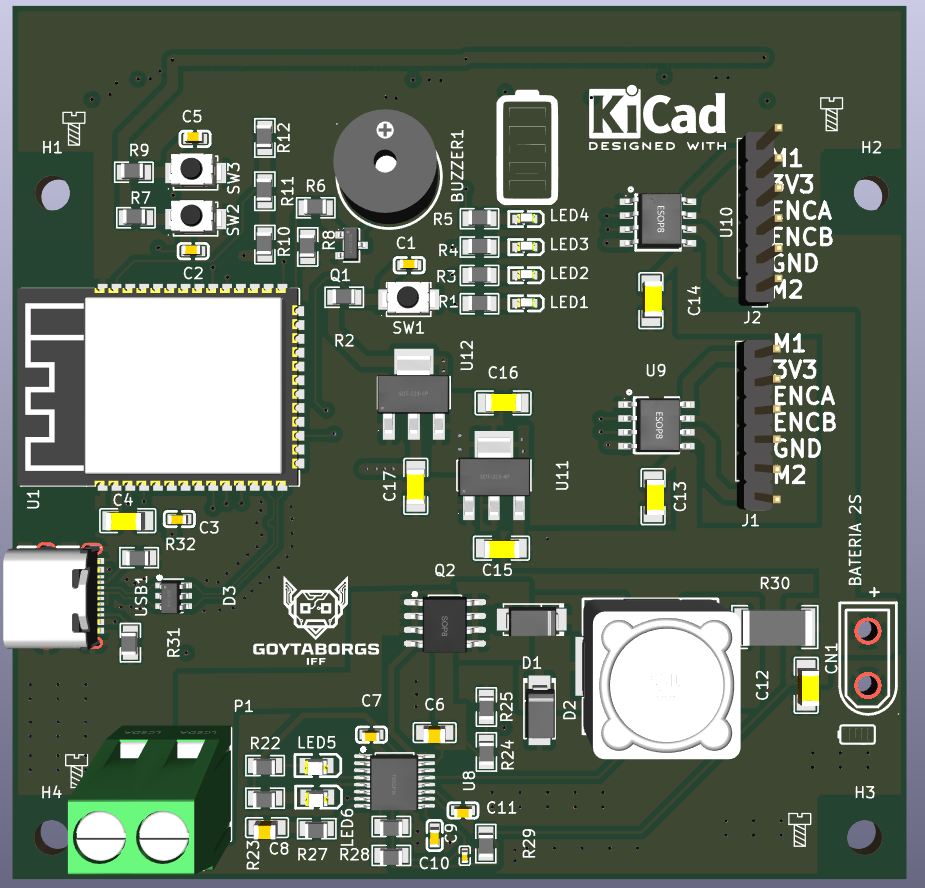
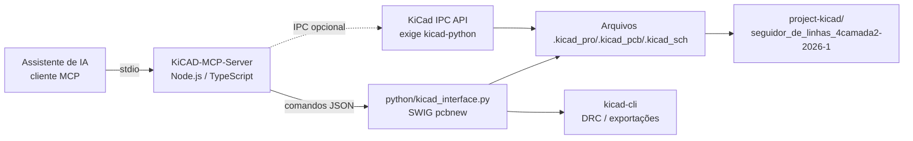
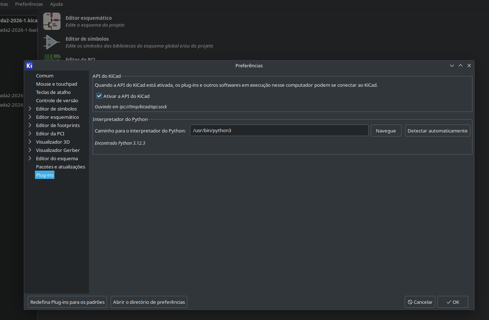

# KiCAD MCP para VS Code — mcp-kicad-vscode

Workspace que combina um **servidor MCP para automação de design de PCB com KiCad** e o **projeto de hardware** (placa de circuito impresso) desenvolvido com ele.

- **`KiCAD-MCP-Server/`** — Servidor MCP (Node.js/TypeScript + Python) que permite que assistentes de IA controlem o KiCad: criação de esquemáticos, layout de PCB, roteamento, DRC, exportação e integração com catálogos de componentes.
- **`project-kicad/`** — Projeto KiCad real: placa **seguidor de linhas** de 4 camadas (`seguidor_de_linhas_4camada2-2026-1`), com 97 footprints e 83 nets.

## Visão geral

O objetivo deste workspace é usar IA assistida para projetar, validar e fabricar placas. O servidor expõe as operações do KiCad como *tools* MCP (233 registradas), permitindo que um agente abra projetos, posicione componentes, roteie trilhas, crie zonas, rode DRC e exporte arquivos de fabricação — com o [Model Context Protocol](https://modelcontextprotocol.io/) (spec 2025-06-18).

Principais características:

- **233 ferramentas MCP** em 16 categorias (esquemático, PCB, roteamento, regras/DRC, exportação, bibliotecas, JLCPCB/DigiKey, freerouting etc.);
- **Fluxo de trabalho completo de esquemático**: criação, edição em lote, hierarquia, netlist, ERC;
- **Design de PCB**: componentes, trilhas, vias, zonas/pours, clearances, DRC, fotos 2D;
- **Integração com fabricantes**: catálogo JLCPCB (2,5 M+ peças), datasheets via LCSC e busca DigiKey;
- **Autorouter Freerouting** integrado;
- **Suporte multiplataforma** (Linux, Windows, macOS);
- **Integração em tempo real com a UI do KiCad via IPC API** (experimental — exige `kicad-python`);
- Repositório upstream: [mixelpixx/KiCAD-MCP-Server](https://github.com/mixelpixx/KiCAD-MCP-Server) (detalhes completos no [README do servidor](KiCAD-MCP-Server/README.md)).

## Demonstração

Preview da placa do projeto:



Vídeo de preview da PCB (arquivo local — não incorporado diretamente):

[Preview da PCB seguidor de linhas](project-kicad/video/PREVIAPCBSEGUIDORLINHAS.mp4)


## Funcionalidades

### Servidor MCP (KiCAD-MCP-Server)

- [x] 233 tools MCP registradas + descoberta por palavra-chave (`search_tools`, `get_category_tools`)
- [x] Recursos dinâmicos (23) expondo o estado do projeto
- [x] Ferramentas de esquemático: componentes, wires, labels, hierarquia, ERC, netlist, sync PCB↔esquemático
- [x] Ferramentas de PCB: board, camadas, componentes, roteamento, vias, zonas, DRC, import/export
- [x] Criação de footprints e símbolos personalizados
- [x] Integração JLCPCB (busca local + API), datasheets LCSC e DigiKey
- [x] Roteador Freerouting (via Java, Docker ou Podman)
- [x] Suporte a importação de PCBs de fornecedores (PADS, Altium, Eagle, Allegro etc.)
- [ ] Backend IPC em tempo real — experimental, exige `kicad-python` (padrão atual local: SWIG)

### Projeto de hardware (project-kicad)

- [x] Placa 4 camadas (F.Cu, B.Cu, In1.Cu, In2.Cu) — 82,2 × 80,3 mm
- [x] 97 componentes (80 da lib `mylib`, sensores IR `ITR8307`, ESP32, ponte H, MPPT, USB-C — conforme nets e BOM)
- [x] 83 nets (GND, +5V, +3V3, VBAT e sinais `/mptt/*`, `/ponteH/*`, `/usb-c/*`, `/IO*`)
- [x] DRC limpo (0 violações verificado via `kicad-cli`)
- [x] `BOM.csv` e bibliotecas locais (`mylib/`, `logopcb/`)

## Arquitetura



Fluxo: o agente de IA envia chamadas de ferramenta ao servidor Node; o servidor despacha para o processo Python que opera o KiCad via `pcbnew` (SWIG) — ou pela IPC API quando disponível — e os resultados refletem nos arquivos do projeto KiCad.

## Estrutura do projeto

```text
mcp-kicad-vscode/
├── KiCAD-MCP-Server/          # Servidor MCP (repo aninhado, upstream mixelpixx)
│   ├── src/                   # TypeScript — servidor e 233 tools
│   ├── python/                # Interface pcbnew (SWIG) / IPC
│   ├── tests/                 # testes pytest (test_*.py)
│   ├── tests-ts/              # testes Vitest (*.test.ts)
│   ├── config/                # exemplos de configuração de clientes MCP
│   ├── docs/                  # documentação detalhada do servidor
│   ├── package.json           # scripts de build/test/lint
│   ├── pyproject.toml         # Black/Isort/MyPy
│   └── run-kicad-mcp.sh       # launcher com env do KiCad (snap)
├── project-kicad/             # Projeto de hardware (PCB)
│   ├── seguidor_de_linhas_4camada2-2026-1.kicad_pro/.kicad_pcb/.kicad_sch
│   ├── mylib/                 # bibliotecas de footprints locais
│   ├── imagens/               # imagens da placa
│   ├── video/                 # vídeo de preview
│   ├── docs/                  # PDF do esquemático e listagens
│   └── BOM.csv
├── docs/                      # guias de setup local (pt-BR)
└── .gitignore
```

## Requisitos

### Software

| Ferramenta | Versão | Observação |
|---|---|---|
| Node.js | ≥ 20 | usado no CI (20.x/22.x) |
| TypeScript | 5.9 | compilação via `npm run build` |
| npm | — | gerenciador de dependências |
| Python | ≥ 3.9 | local: 3.12.3 (`.venv`) |
| KiCad | 9.0.7 | installação **snap** (`/snap/kicad/22`) |
| JRE | 21 | apenas para suítes de teste do Freerouting (CI) |

Opcional: `kicad-python` (`pip install kicad-python`) habilita o backend IPC em tempo real; sem ele o servidor usa o backend SWIG.

### Hardware

- Para executar o servidor: computador com o KiCad instalado (o próprio KiCad é o "hardware").
- Projeto `project-kicad`: placa 4 camadas (ver [BOM.csv](project-kicad/BOM.csv) e [esquemático](project-kicad/docs/esquemático) para lista completa de componentes).

## Instalação

### 1. Clonar e preparar o servidor

```bash
cd KiCAD-MCP-Server
npm ci
npm run build
```

### 2. Ambiente Python

```bash
cd KiCAD-MCP-Server
python -m venv .venv
source .venv/bin/activate
pip install -r requirements.txt -r requirements-dev.txt
```

### 3. KiCad (snap) e habilitação da IPC API

Instale o KiCad 9 via snap e, no KiCad, habilite a API IPC em:

**Preferences → Plugins → Enable IPC API Server**



> Passo a passo completo de instalação local em [`docs/setup-mcp.txt`](docs/setup-mcp.txt).

## Configuração

### Variáveis de ambiente (opcional)

Copie [`.env.example`](KiCAD-MCP-Server/.env.example) para `.env` para habilitar integrações com JLCPCB e DigiKey:

```bash
cp KiCAD-MCP-Server/.env.example KiCAD-MCP-Server/.env
```

- `JLCPCB_APP_ID`, `JLCPCB_API_KEY`, `JLCPCB_API_SECRET` — API da JLCPCB (opcional; sem elas, a busca usa a base local);
- `DIGIKEY_CLIENT_ID`, `DIGIKEY_CLIENT_SECRET`, `DIGIKEY_LOCALE_*` — API DigiKey (opcional).

**Nunca commite o `.env`** — valores reais não devem aparecer em exemplos ou commits.

### Configuração do cliente MCP

Exemplos para diferentes clientes em `KiCAD-MCP-Server/config/`:

- `claude-desktop-config.json`, `opencode.json`, `vscode-mcp.example.json`
- `linux-config.example.json`, `macos-config.example.json`, `windows-config.example.json`

Variáveis de ambiente relevantes (definidas em `.vscode/mcp.json` — caminhos **máquina-específicos**, ajuste conforme sua instalação):

| Variável | Efeito |
|---|---|
| `KICAD_BACKEND=auto` | tenta IPC e cai para SWIG se `kicad-python` não estiver instalado |
| `KICAD_PYTHON` | caminho do interpretador Python do servidor (venv) |
| `PYTHONPATH` | `pcbnew` do KiCad (snap) |
| `LD_LIBRARY_PATH` | bibliotecas nativas do KiCad (snap) — obrigatório |
| `KICAD_AUTO_LAUNCH=false` | não abre o KiCad automaticamente |

## Uso

### Iniciar o servidor MCP

No VS Code: **Ctrl+Shift+P → `MCP: Start Server`** (usa `.vscode/mcp.json`).

Ou pelo terminal:

```bash
cd KiCAD-MCP-Server
./run-kicad-mcp.sh          # launcher com env do KiCad snap
# equivale a:
node dist/index.js          # sem env do KiCad: SWIG/headless
```

### Exemplos de fluxo com o assistente de IA

Com o servidor MCP ativo, um assistente pode, por exemplo:

1. `open_project` no `project-kicad/seguidor_de_linhas_4camada2-2026-1.kicad_pro`;
2. `get_board_info` / `get_component_list` para inspecionar a placa;
3. `run_drc` para validar regras de projeto;
4. `export_gerber` / `export_drill` para gerar arquivos de fabricação.

Todos os comandos de ferramentas MCP estão documentados em `KiCAD-MCP-Server/docs/TOOL_INVENTORY.md`.

### Trabalhando com o projeto KiCad

Abrir o projeto no KiCad e/ou validar DRC pela linha de comando (com o ambiente do snap exportado):

```bash
cd project-kicad
kicad-cli pcb drc --output /tmp/drc.json --format json seguidor_de_linhas_4camada2-2026-1.kicad_pcb
```

## Solução de problemas

| Sintoma | Causa provável | Solução |
|---|---|---|
| `ImportError: libwx_gtk3u_gl-3.2.so.0` | `LD_LIBRARY_PATH` ausente | Usar `./run-kicad-mcp.sh` ou exportar as variáveis do snap |
| `No module named 'pcbnew'` | `PYTHONPATH` errado | `export PYTHONPATH=/snap/kicad/22/usr/lib/python3/dist-packages` |
| Servidor em `backend: swig`, sem realtime | `kicad-python` não instalado | `pip install kicad-python` (ou aceitar SWIG) |
| `kicad-cli: error while loading shared libraries: libkicommon.so` | env do snap ausente | Exportar `LD_LIBRARY_PATH` antes do `kicad-cli` |
| DRC acusa clearance de zona | fill de zona desatualizado | Refill das zonas (tecla **B** no KiCad ou `pcbnew.ZONE_FILLER`) |
| `docs/TOOL_INVENTORY.md` desatualizado | tools adicionadas/removidas | `npm run docs:tools` |

## Desenvolvimento

```bash
cd KiCAD-MCP-Server

npm run build           # compilar TypeScript -> dist/
npm run dev             # watch + nodemon (redeployment automático)
npm run lint            # eslint src/ + black --check + mypy + flake8 (python/)
npm run format          # prettier 'src/**/*.ts' && black python/
npm run test            # vitest (tests-ts/) + pytest (tests/)
npm run test:ts         # somente testes TypeScript
npm run test:py         # somente testes Python
npm run test:coverage   # pytest com cobertura (pytest-cov)
npm run docs:tools      # regenerar docs/TOOL_INVENTORY.md
pre-commit run --all-files   # hooks de qualidade (git)
```

- **Testes**: Vitest (`tests-ts/*.test.ts`) e pytest (`tests/test_*.py`, `testpaths = tests`).
- **CI**: `.github/workflows/ci.yml` (matrix Node 20/22 e Python 3.9–3.12) — inclui gates de `docs:tools:check` e `lint:ts`.
- **Estilo*KiCAD-MCP-Server/*: TypeScript estrito + Prettier/ESLint; Python Black (100 col) + Isort + MyPy + Flake8.

## Licença

- **KiCAD-MCP-Server:** MIT (ver [`LICENSE`](KiCAD-MCP-Server/LICENSE)).
- **Workspace/projeto raiz:** licença não identificada — nenhum arquivo `LICENSE` foi encontrado na raiz deste repositório.

## Créditos

- Servidor MCP: projeto upstream [KiCAD-MCP-Server](https://github.com/mixelpixx/KiCAD-MCP-Server) (autores originais conforme repositório; documentação detalhada em [`KiCAD-MCP-Server/README.md`](KiCAD-MCP-Server/README.md)).
- Projeto de hardware `seguidor_de_linhas_4camada2-2026-1`: autoria não identificada nos arquivos do workspace.
